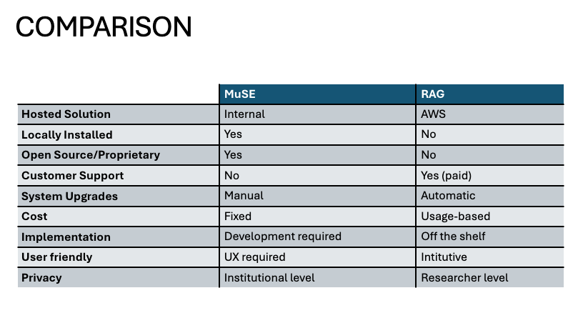

# Open science and digital infrastructures

- Who are we?
- How we work?
- General view
Open science no national guidelines - no national repository


::: notes 
120 peoples  - contemporary and digital history - one of 4 Interdisciplinary Centres 
4 axes 
10 years in 2027
and  directly DRI 

part of the university - no nationa level
::: 

# C2DH and DRI

```{dot}
graph G {
  layout=neato
  rankdir=LR

  // Clusters as nodes
  RSD [label="Research software dev" shape=box style=filled fillcolor="#EAF3DE" color="#3B6D11" fontcolor="#27500A" penwidth=2]
  OS  [label="Open science"          shape=box style=filled fillcolor="#E6F1FB" color="#185FA5" fontcolor="#0C447C" penwidth=2]
  DG  [label="Data governance"       shape=box style=filled fillcolor="#EEEDFE" color="#534AB7" fontcolor="#3C3489" penwidth=2]

  // Tool nodes
  GitLab      [label="GitLab / GitHub"           shape=ellipse style=filled fillcolor="#F1EFE8" color="#5F5E5A"]
  HF          [label="HuggingFace / OpenAI / AWS" shape=ellipse style=filled fillcolor="#F1EFE8" color="#5F5E5A"]
  Impresso    [label="Impresso data lab"          shape=ellipse style=filled fillcolor="#F1EFE8" color="#5F5E5A"]
  Nainuwa     [label="Nainuwa - Muse"             shape=ellipse style=filled fillcolor="#F1EFE8" color="#5F5E5A"]
  Transkribus [label="Transkribus"                shape=ellipse style=filled fillcolor="#F1EFE8" color="#5F5E5A"]
  Orbilu      [label="Orbilu / Zenodo"            shape=ellipse style=filled fillcolor="#F1EFE8" color="#5F5E5A"]
  Omeka       [label="Omeka"                      shape=ellipse style=filled fillcolor="#F1EFE8" color="#5F5E5A"]
  JDH         [label="Digital monography / JDH"  shape=ellipse style=filled fillcolor="#F1EFE8" color="#5F5E5A"]
  Dataverse   [label="Dataverse"                  shape=ellipse style=filled fillcolor="#F1EFE8" color="#5F5E5A"]
  Nodegoat    [label="Nodegoat"                   shape=ellipse style=filled fillcolor="#F1EFE8" color="#5F5E5A"]
  CatDV       [label="CatDV"                      shape=ellipse style=filled fillcolor="#F1EFE8" color="#5F5E5A"]

  // Research software dev edges (green)
  RSD -- GitLab      [color="#3B6D11"]
  RSD -- HF          [color="#3B6D11"]
  RSD -- Impresso    [color="#3B6D11"]
  RSD -- Nainuwa     [color="#3B6D11"]
  RSD -- Transkribus [color="#3B6D11"]

  // Open science edges (blue)
  OS -- Orbilu      [color="#185FA5"]
  OS -- Omeka       [color="#185FA5"]
  OS -- JDH         [color="#185FA5"]
  OS -- Dataverse   [color="#185FA5"]
  OS -- Transkribus [color="#185FA5"]
  OS -- GitLab      [color="#185FA5"]

  // Data governance edges (purple)
  DG -- Dataverse   [color="#534AB7"]
  DG -- Nodegoat    [color="#534AB7"]
  DG -- CatDV       [color="#534AB7"]
  DG -- Orbilu      [color="#534AB7"]
  DG -- GitLab      [color="#534AB7"]
  DG -- Impresso    [color="#534AB7"]
  DG -- Omeka       [color="#534AB7"]
}
```

::: notes 

17 members
11 technical staff
4 research scientists
2 postdoc researchers
12 nationalities


At the university level:
- CatDV university level - media 
- Orbilu luxembourgish zeonodo
- GitLab

At the C2DH level
- Transkribus *(general account)* | Handwritten text recogniser |
- Nodegoat *(own instance)* | Relational data modeller |

- Dataverse *(own instance)* | Research data repository |
- Nainuwa | Digital library system |
- Omeka | Digital collections publisher |

Home made:
- Impresso data lab 
- Digital monography / JDH
- Muse | Multimedia search engine | Home made

- Global solution 
GitHub / HuggingFace / OpenAI / AWS 
Code version control 
Model & dataset hub 
AI API provider 
Cloud computing platform 


:::

# At the different stages of the research lifecycle

| Phase | Tool | Definition | Cluster |
|-------|------|------------|---------|
| **Collect** | Transkribus *(general account)* | Handwritten text recogniser | Research software dev · Open science |
| **Collect** | Nodegoat *(own instance)* | Relational data modeller | Research software dev · Data governance |
| **Collect** | Muse | Multimedia search engine | Research software dev |
| **Archive** | Dataverse *(own instance)* | Research data repository | Open science · Data governance |
| **Archive** | Nainuwa | Digital library system | Open science · Data governance |

# At the different stages of the research lifecycle

| Phase | Tool | Definition | Cluster |
|-------|------|------------|---------|
| **Publish** | Omeka | Digital collections publisher | Open science · Data governance |
| **Infrastructure** | GitHub / Gitlab *(own instance)* | Code version control | Research software dev · Data governance |
| **Infrastructure** | HuggingFace | Model & dataset hub | Research software dev · Data governance |
| **Infrastructure** | OpenAI | AI API provider | Research software dev |
| **Infrastructure** | AWS | Cloud computing platform | Research software dev · Data governance |


::: notes 
Sovereignty spectrum 
Maintenance cost vs adaptability trade-off 
Institutional layering creates fragility —

# The challenge

- Quality of the datas 
- Legal requirements
- Preservation
- No common solution
- Not miss the potential of AI - pression to innovate

::: notes 
:::

# “Thinkering”

- To the beginning of the project to the end
- In house / off-the-shelf

::: notes 
Tool shapes thought — the choice of tool is never neutral; using AWS versus GRid500, or Omeka versus a custom stack, actively influences research design and what questions become askable
Versatility as a core skill — knowing when to tinker (build, adapt, hack) versus when to trust an existing tool is itself a research competency, not just a technical one
Control as an open science value — maintaining the ability to inspect, modify, and share your toolchain is part of reproducibility; black-box off-the-shelf solutions can undermine this
:::

# Cost and benefit

First trial with commercial solution
{.r-stretch fig-align="center"}

::: notes 
Example of the RAG
::: 

# Conclusion


- Open science required more time and culture 

::: notes 
thanks to network - inspiration for us 
::: 

# What we need

Intermediate place - try to find solution IN-BETWEEN
@MounierDumasPrimbault2023

Use feedback of the user

> MISSION to comply with the open science

::: notes 
GRid500 
High-performance computing cluster
Data sovereignty — GRid500 keeps data on institutional/national infrastructure, making GDPR compliance and data governance straightforward; AWS implies data leaving to commercial US-based servers, raising legal and ethical questions for sensitive research data
Cost model — GRid500 is typically funded institutionally (no per-use billing); AWS follows a pay-as-you-go model that can escalate quickly at scale
Reproducibility — both support reproducible pipelines, but GRid500 environments are often fixed and stable; AWS offers more flexibility but also more configuration drift risk
Open access alignment — GRid500 aligns naturally with public research mandates and open science values; AWS is commercial infrastructure, though widely used in open science workflows

:::

# Bibliography

