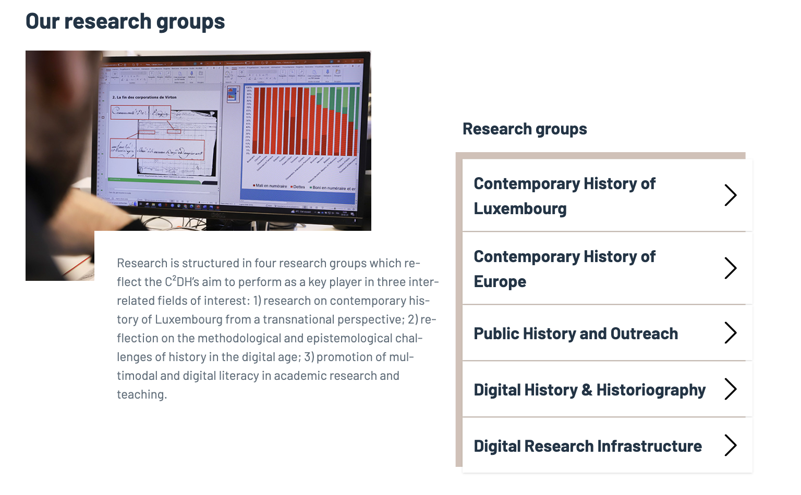
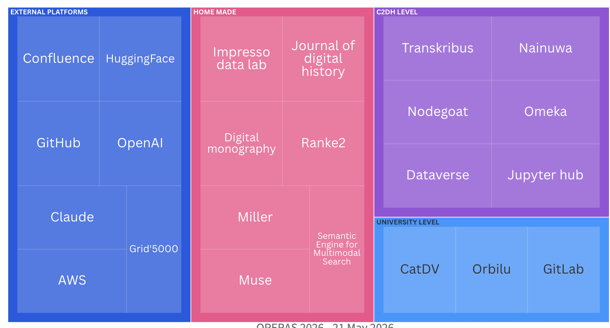

# A young center, a small country, humanities: where do you begin?

::: notes 
and we go to explain what you are trying to do
how we thinker
The C2DH was founded in 2016. We are based in Luxembourg — a small, multilingual country 
We have no national framework telling us what to do. 
So the question we faced was simple: where do you even begin?
:::


# C2DH and DRI


{.r-stretch fig-align="center"}

::: notes 
 we are a small unit with 120 peoples distributed accross 5 axes
and me i belong to the digital research infrastructure
We are a small team — 17 people in the digital research infrastructure unit, across 12 nationalities, mixing technical staff, research engineers, and researchers. 
That diversity is a strength, but it also means we don't always share the same culture around tools, openness, or reproducibility. 
Building infrastructure here is also about building a shared practice.
::: 

# The challenges

From the technical and legal perspective

- Quality of the data
- Legal requirements
- Preservation
- No common solution
- Not miss the potential of AI - pression to innovate

From a user-centred perspective

- Shared culture

::: notes
The challenges come from two directions. 
On the technical and legal side: data quality is uneven, legal requirements are strict, preservation is complex, and there is no single solution that fits everything. 
And on top of that, there is real pressure to not miss the AI wave — to innovate, to experiment. 
On the human side, the hardest challenge is cultural. 
Getting researchers to document, to share, to use common tools — that takes time. 
And this is the tension at the heart of open science: we are asked to be transparent and open, but also secure, sovereign, and GDPR-compliant. 
These goals do not always point in the same direction.
:::


# Our DRI ecosystem

<iframe src='https://flo.uri.sh/visualisation/29066223/embed' title='Interactive or visual content' class='flourish-embed-iframe' frameborder='0' scrolling='no' style='width:100%;height:600px;' sandbox='allow-same-origin allow-forms allow-scripts allow-downloads allow-popups allow-popups-to-escape-sandbox allow-top-navigation-by-user-activation'></iframe>

::: notes 
CatDV is a media asset management system hosted at the Media Center of the university
Transkribus we have a general account
Notegoat own instance and we become key-user as we have several project on our portfolio
However, this comes with a tension: exporting data out of Nodegoat is not straightforward, which raises real questions around long-term portability and reproducibility. Once your data is modelled inside Nodegoat's relational structure, migrating it to another system requires significant effort — a reminder that even open-source, self-hosted tools can create forms of dependency."
Dataverse our own instance behind the firewall
::: 

# Our DRI ecosystem

{.r-stretch fig-align="center"}

::: notes 
https://public.flourish.studio/visualisation/29066223/
::: 

# Example of use case 


> Involving the different steps of the research lifecycle and multiple tools

| Stage | Tool | Level |
|---|---|---|
| **Planning** | Confluence | ☁️ External cloud |
| **Collecting** | Nainuwa | 🏛️ C2DH on-premises |
| **Analysing** | Semantic Engine (AWS) *or* Muse | ☁️ External *vs* 🏛️ Internal |
| **Publishing** | JDH / Omeka | 🏛️ C2DH |
| **Archiving** | Dataverse | 🏛️ Behind firewall |

::: notes
Let me walk you through a concrete example — a project that touches every stage of the research lifecycle. 
We start planning in Confluence — convenient and collaborative, but hosted externally by Atlassian. 
Already at the planning stage, our documentation lives outside our walls. 
Then we collect material through Nainuwa, our own digital library system, on-premises and fully under our control. 
For analysis, this is where the real tension appears: we can use the Semantic Engine for Multimodal Search, which runs on AWS — powerful and scalable, but external — or Muse, our internal C2DH tool, which keeps everything behind our firewall. Same research need, two very different choices in terms of sovereignty and openness. We publish through the JDH or Omeka, both rooted in open access values. And finally we archive in Dataverse, our own instance, on-premises, behind the firewall — ensuring long-term preservation under our own governance. The same project, from start to finish, crosses multiple levels of control, openness, and dependency. That is the reality of our infrastructure.
:::


# The tensions

Analysing with AWS or Muse — Two search approaches, two trade-offs

**Our pragmatic response**

- We chose AWS to allow experimentation at scale
- We created a **user group** to collectively assess the trade-offs
- No perfect answer — every choice is a negotiation between openness, sovereignty, performance, and cost

::: notes

Muse uses keyword search powered by Solr — fast, controlled, fully on-premises. 
The Semantic Engine uses natural language, making data discovery easier and more intuitive for researchers — but it runs on AWS, outside our walls. It is not just a question of sovereignty, it is also a question of what kind of search experience you offer your users.
The Semantic Engine runs on AWS: fast and scalable, but the data leaves our institution and we have no control over the code.
Muse keeps everything behind our firewall — transparent and sovereign — but our team carries the full maintenance burden. 
We went pragmatic: chose AWS to experiment, but built a user group to evaluate the trade-offs collectively and keep the decision transparent. That is thinkering in practice.
:::

# “Thinkering”

- Benchmarking tools seriously before adopting them

- Covering the project to the end, not just the exciting early phase

- Balancing in-house development against off-the-shelf adoption

- Maintaining the ability to inspect, modify, and share your tools

- Investing in interoperability between tools

::: notes 
We call our approach 'thinkering' — a mix of thinking and tinkering. 
It means benchmarking tools seriously before adopting them. 
It means following a project through to the end, not just the exciting early phase. 
It means constantly balancing in-house development against off-the-shelf adoption. 
Most importantly, it means maintaining the ability to inspect, modify, and share our tools — because a toolchain you cannot understand or open 
is not compatible with open science. 
And it means investing in interoperability — tools that talk to each other, that don't create silos. 
The choice of tool is never neutral.
AWS and a national grid infrastructure as Grid'5000 (A large-scale scientific computing infrastructure funded by the French public research ecosystem, offering dedicated, configurable clusters for experimental research) are not equivalent choices. They shape what research questions you can ask.
:::

# Conclusion

- Open science requires more time and culture  

- Find solutions **IN-BETWEEN** — not fully sovereign, not fully open, but always moving in the right direction @MounierDumasPrimbault2023

- Use feedback from our users

- Draw from shared practices and networks like OPERAS

> **Our mission: to comply with the spirit of open science — not just its checkboxes.**

::: notes
To conclude: open science in a small humanities center is not a switch you flip. It requires time, culture, and a willingness to sit in an uncomfortable in-between — not fully sovereign, not fully open, not fully standardized, but always trying to move in the right direction. 
Our mission, as we put it, is to comply with the spirit of open science — not just its checkboxes.
We draw a lot of inspiration from networks like OPERAS, from shared practices across centers, universities. 
Because the best infrastructure we have built is not a tool — it is a community of people asking the same hard questions. 
Thank you.
:::


# Mapping the tools accross our pillars

```{dot}
graph G {
  layout=neato
  rankdir=LR

  // Clusters as nodes
  RSD [label="Research software dev" shape=box style=filled fillcolor="#EAF3DE" color="#3B6D11" fontcolor="#27500A" penwidth=2]
  OS  [label="Open science"          shape=box style=filled fillcolor="#E6F1FB" color="#3B6D11" fontcolor="#27500A" penwidth=2]
  DG  [label="Data governance"       shape=box style=filled fillcolor="#EEEDFE" color="#3B6D11" fontcolor="#27500A" penwidth=2]

  // Tool nodes
  GitLab      [label="GitLab / GitHub"           shape=ellipse style=filled fillcolor="#F1EFE8" color="#5F5E5A"]
  HF          [label="HuggingFace / OpenAI / AWS" shape=ellipse style=filled fillcolor="#F1EFE8" color="#5F5E5A"]
  Impresso    [label="Impresso data lab"          shape=ellipse style=filled fillcolor="#F1EFE8" color="#5F5E5A"]
  Nainuwa     [label="Nainuwa - Muse"             shape=ellipse style=filled fillcolor="#F1EFE8" color="#5F5E5A"]
  Transkribus [label="Transkribus"                shape=ellipse style=filled fillcolor="#F1EFE8" color="#5F5E5A"]
  Orbilu      [label="Orbilu / Zenodo"            shape=ellipse style=filled fillcolor="#F1EFE8" color="#5F5E5A"]
  Omeka       [label="Omeka"                      shape=ellipse style=filled fillcolor="#F1EFE8" color="#5F5E5A"]
  JDH         [label="Digital monography / JDH"  shape=ellipse style=filled fillcolor="#F1EFE8" color="#5F5E5A"]
  Dataverse   [label="Dataverse"                  shape=ellipse style=filled fillcolor="#F1EFE8" color="#5F5E5A"]
  Nodegoat    [label="Nodegoat"                   shape=ellipse style=filled fillcolor="#F1EFE8" color="#5F5E5A"]
  CatDV       [label="CatDV"                      shape=ellipse style=filled fillcolor="#F1EFE8" color="#5F5E5A"]

  // Research software dev edges (green)
  RSD -- GitLab      [color="#3B6D11"]
  RSD -- HF          [color="#3B6D11"]
  RSD -- Impresso    [color="#3B6D11"]
  RSD -- Nainuwa     [color="#3B6D11"]
  RSD -- Transkribus [color="#3B6D11"]

  // Open science edges (blue)
  OS -- Orbilu      [color="#185FA5"]
  OS -- Omeka       [color="#185FA5"]
  OS -- JDH         [color="#185FA5"]
  OS -- Dataverse   [color="#185FA5"]
  OS -- Transkribus [color="#185FA5"]
  OS -- GitLab      [color="#185FA5"]

  // Data governance edges (purple)
  DG -- Dataverse   [color="#534AB7"]
  DG -- Nodegoat    [color="#534AB7"]
  DG -- CatDV       [color="#534AB7"]
  DG -- Orbilu      [color="#534AB7"]
  DG -- GitLab      [color="#534AB7"]
  DG -- Impresso    [color="#534AB7"]
  DG -- Omeka       [color="#534AB7"]
}
```


::: notes 
::: 

# Bibliography

